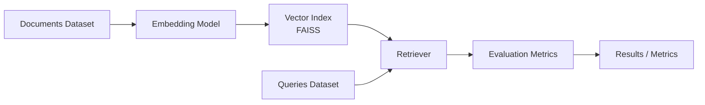
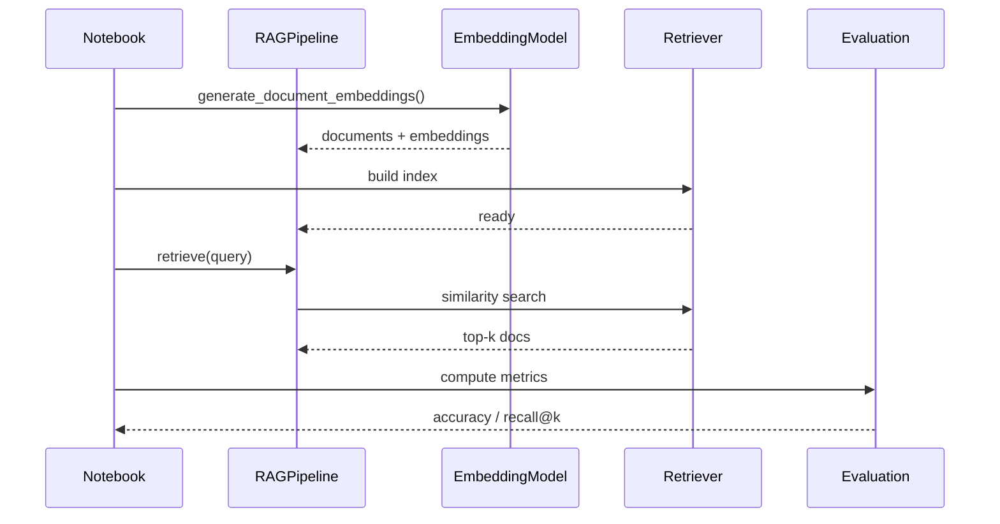

# RAG Evaluation Framework

A lightweight research framework for evaluating **Retrieval-Augmented Generation (RAG)** systems.

The project focuses on measuring the quality of document retrieval, which is the most critical component of RAG pipelines. It provides a small modular system for:

- embedding documents
- retrieving relevant context
- evaluating retrieval performance
- experimenting with different embedding models and datasets

This repository is designed as a **research / experimentation environment**, not a production RAG system.

## Architecture

The framework implements a simplified RAG pipeline composed of four main layers.



### Components

| Component      | Description                                    |
| -------------- | ---------------------------------------------- |
| EmbeddingModel | Generates vector embeddings for documents      |
| Retriever      | Performs similarity search using FAISS         |
| RAGPipeline    | Orchestrates embedding and retrieval           |
| Evaluation     | Computes metrics such as Accuracy and Recall@k |

## Project structure

```graphql
rag-evaluation-framework/
│
├── data/
│   ├── raw/                      # Source datasets
│   │   ├── documents.json
│   │   └── queries.json
│   │
│   └── processed/                # Generated artifacts
│       └── embeddings.parquet
│
├── notebooks/
│   └── rag_evaluation.ipynb      # End-to-end experimentation workflow
│
├── src/
│   └── rag_eval/
│       ├── __init__.py
│       ├── cache.py              # Simple cache to persist embeddings
│       ├── cli.py                # Command-line interface
│       ├── datasets.py           # Dataset loading utilities
│       ├── embeddings.py         # Embedding model interface
│       ├── retrieval.py          # FAISS-based retriever
│       ├── rag.py                # RAGPipeline orchestration
│       ├── llm.py                # LLM interaction utilities
│       ├── evaluation.py         # Retrieval metrics + evaluation helpers
│       └── utils.py              # General helper functions
│
├── tests/                        # Unit and integration tests
│   ├── test_evaluation.py
│   ├── test_retriever.py
│   └── test_rag_pipeline.py
│
├── requirements.txt
├── pyproject.toml
├── Makefile
├── README.md
└── .gitignore
```

## Evaluation Metrics

The framework currently implements two core retrieval metrics.

### Retrieval Accuracy

Measures whether the top-ranked document is the correct one:

```
  accuracy = correct_top1 / total_queries
```

### Recall@k

Measures whether the correct document appears anywhere in the top-k results:

```
  recall@k = queries_with_correct_doc_in_top_k / total_queries
```

These metrics allow quick benchmarking of:

- embedding models
- chunking strategies
- retrieval parameters
- document preprocessing

## Project Setup

This project uses a `src/` layout with editable install for development. Follow these steps to set up your environment and run the notebook.

### 1. Clone the Repository

```bash
git clone https://github.com/jsandino/rag-evaluation-framework.git
cd rag-evaluation-framework
```

### 2. Create a Virtual Environment

```bash
python -m venv .venv
```

On Linux/Mac:

```
source .venv/bin/activate
```

On Windows:

```bash
.venv\Scripts\activate
```

### 3. Install Dependencies

```bash
pip install -r requirements.txt
```

### 4. Install the Package in Editable Mode

```bash
pip install -e .
```

This allows you to import the package directly from `src/rag_eval` and ensures changes in source files are immediately reflected.

### 5. Configure Environment Variables

Setup your local `.env` file and add your Open AI key:

```
cp .env.example .env
```

The key is required only for **embedding generation**.

Unit tests **mock this dependency** , so the API will **not be called during testing.**

## Running the Notebook

The notebook demonstrates the **full evaluation workflow:**

```
notebooks/rag_evaluation.ipynb
```

Steps covered:

1. Load dataset
2. Generate embeddings
3. Build FAISS index
4. Run retrieval
5. Evaluate metrics
6. Inspect results

Open in VS Code or Jupyter and execute sequentially.

## Running Tests

Tests use pytest and mock external APIs.

Run:

```bash
make test
```

or:

```
pytest
```

Test coverage includes:

- retrieval logic
- evaluation metrics
- full pipeline integration

## Example Evaluation Flow



## Future Improvements

Potential extensions for experimentation:

- multiple embedding providers
- LLM answer evaluation
- automated benchmarking
- dataset loaders
- visualization of retrieval quality

## License

MIT License.
